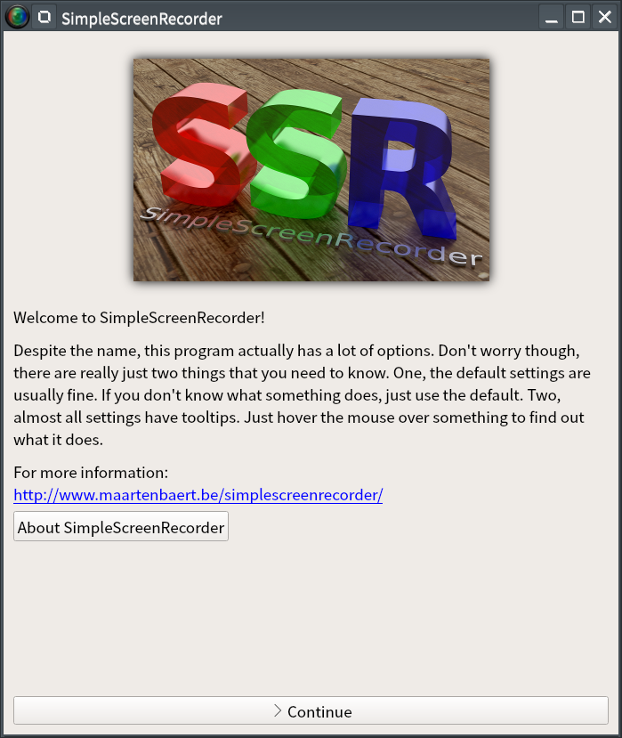

# Unofficial Snap Packaging for SimpleScreenRecorder
<!--
	Use the Staticaly service for easy access to in-repo pictures:
	https://www.staticaly.com/
-->

**This is the unofficial snap for SimpleScreenRecorder**, *"A feature-rich screen recorder"*. It works on Ubuntu, Fedora, Debian, and other major Linux distributions.

Published for  with 💝 by Snapcrafters

## Installation
([Don't have snapd installed?](https://snapcraft.io/docs/core/install))

### In a Terminal
    # Install the snap #
    sudo snap install simplescreenrecorder-brlin
    
    # Connect the snap to optional security confinement interfaces #
    ## To allow access to ALSA devices ##
    sudo snap install core
    sudo snap connect simplescreenrecorder-brlin:alsa
    
    # Launch the application #
    simplescreenrecorder-brlin
    
    ## If you have another existing installation ##
    snap run simplescreenrecorder-brlin

### The Graphical Way

## What is Working
* Launch
* PulseAudio audio capture
* ALSA audio capture
* I18N
* Builtin output profiles
* Preview pane
* Log pane
* Hotkeys
* Recording (H.264/Vorbis)

## What is NOT Working...yet 
Check out the [issue tracker](https://github.com/Lin-Buo-Ren/simplescreenrecorder-snap/issues) for known issues.

## Support
* Report issues regarding using this snap to the issue tracker:  
  <https://github.com/Lin-Buo-Ren/simplescreenrecorder-snap/issues>
* You may also post on the Snapcraft Forum, under the `snap` topic category:  
  <https://forum.snapcraft.io/c/snap>
